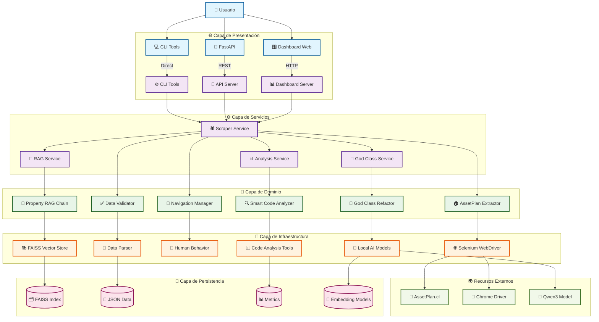
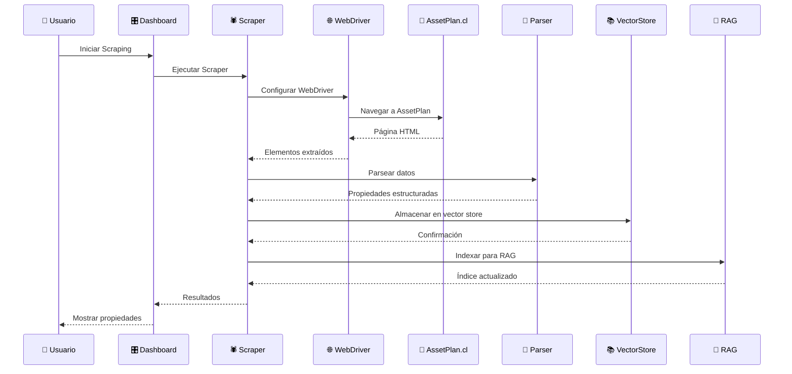
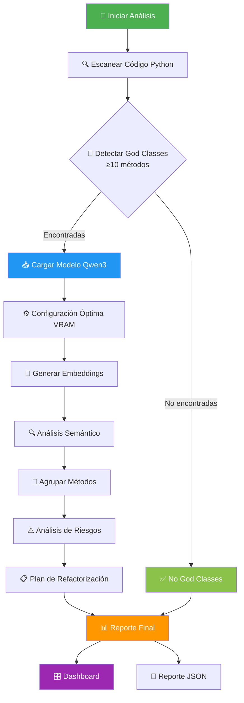
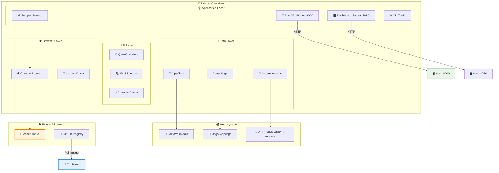
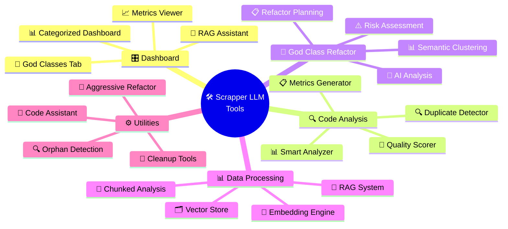
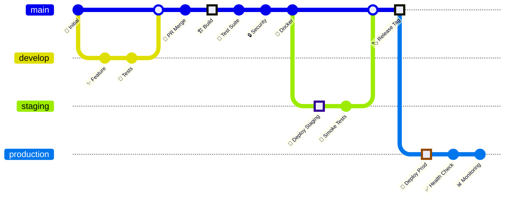
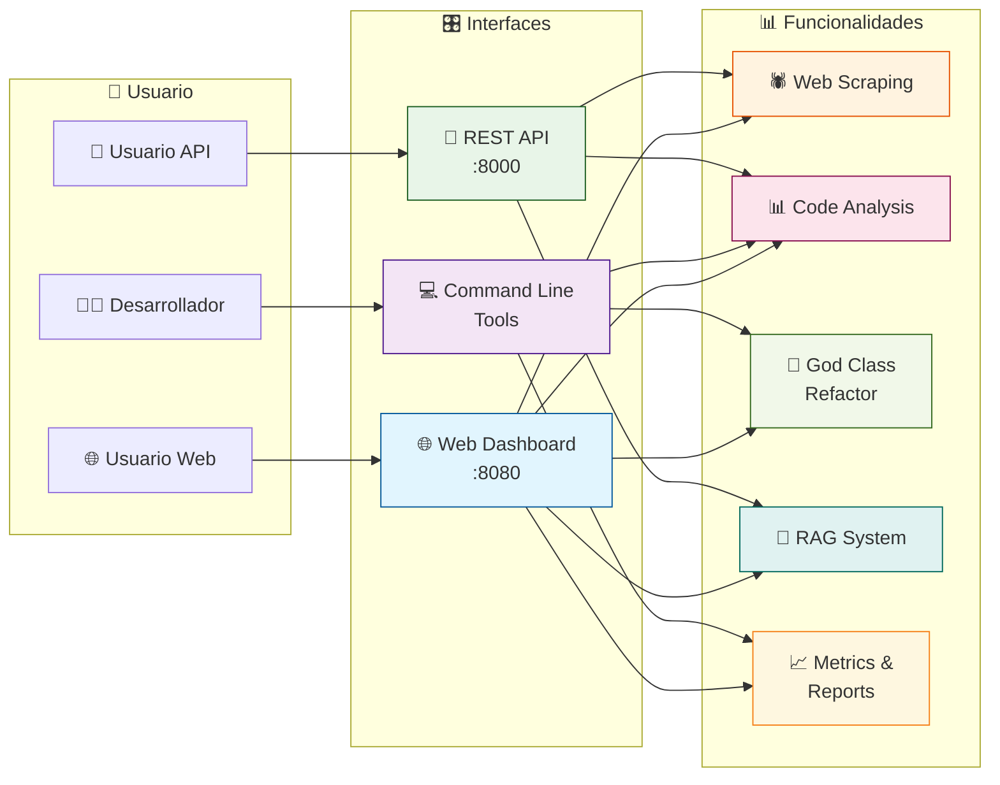

# 🏗️ Arquitectura - Scrapper LLM Inmobiliario

## 📊 Diagrama de Arquitectura Principal

## 🔄 Diagrama de Flujo de Scraping

## 🧠 Diagrama de Análisis de God Classes

## 🐳 Diagrama de Containerización

## 🔧 Diagrama de Herramientas

## 🚀 Diagrama de CI/CD

## 📱 Diagrama de Interfaces

---

## 📝 Notas

- **Arquitectura en Capas**: Separación clara entre presentación, servicios, dominio e infraestructura
- **Containerización**: Todo encapsulado en Docker para portabilidad
- **AI Local**: Modelos Qwen3 ejecutándose localmente sin dependencias externas
- **Escalabilidad**: Diseño modular que permite agregar nuevas funcionalidades
- **Monitoreo**: Dashboards y métricas integradas para observabilidad

Este diagrama muestra la estructura completa de la aplicación, desde las interfaces de usuario hasta la persistencia de datos, incluyendo el flujo de CI/CD y la containerización.