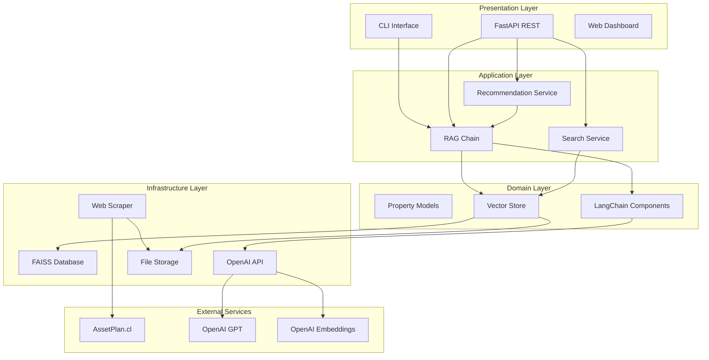
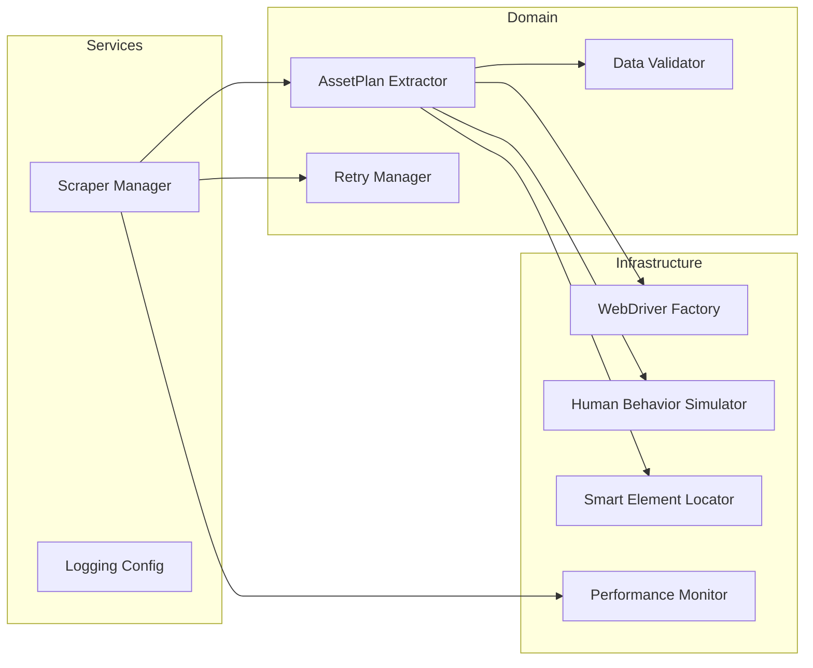
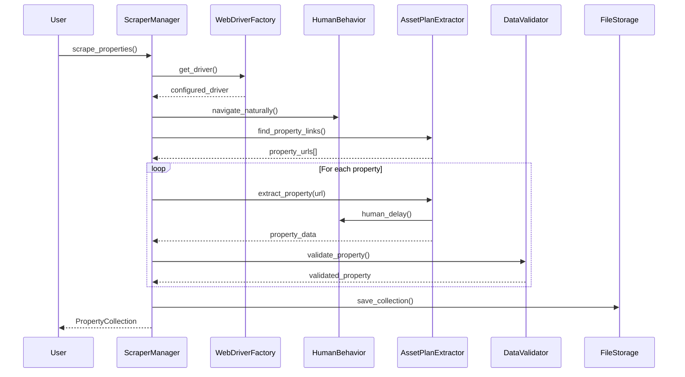
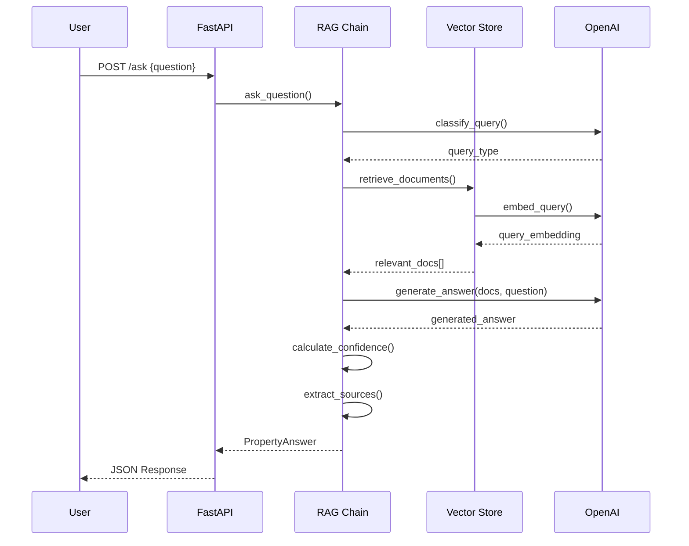
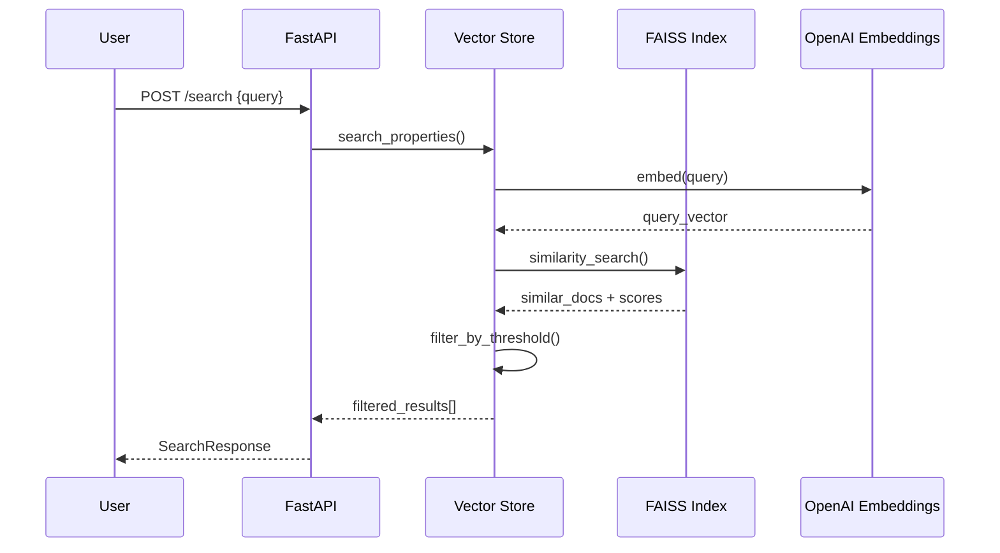

# Arquitectura del Sistema - AssetPlan Property Assistant

## 🏗️ Visión General

El sistema está diseñado siguiendo principios de **arquitectura limpia** y **separación de responsabilidades**, dividido en capas bien definidas que permiten escalabilidad, mantenibilidad y testing eficiente.



## 📋 Componentes Principales

### 1. **Presentation Layer** 🖥️

#### **FastAPI REST Interface**
- **Ubicación**: `src/api/property_api.py`
- **Responsabilidad**: Exponer funcionalidad vía HTTP REST
- **Endpoints**:
  - `POST /ask` - Preguntas en lenguaje natural
  - `POST /search` - Búsqueda semántica
  - `POST /recommend` - Recomendaciones personalizadas
  - `GET /health` - Estado del sistema
  - `GET /stats` - Estadísticas y métricas

#### **CLI Interactivo**
- **Ubicación**: `src/cli/property_chat.py`
- **Responsabilidad**: Interfaz conversacional para usuarios finales
- **Características**:
  - Chat interactivo con Rich formatting
  - Historial de conversaciones
  - Estadísticas en tiempo real

### 2. **Application Layer** 🧠

#### **RAG Chain (Retrieval Augmented Generation)**
- **Ubicación**: `src/rag/property_rag_chain.py`
- **Responsabilidad**: Orquestar Q&A inteligente con citas
- **Componentes**:
  - Query Classification Chain
  - Document Retrieval Chain  
  - Generation Chain con prompt engineering
  - Source Citation Engine
  - Confidence Scoring

#### **Search Service**
- **Integrado en**: PropertyRAGChain
- **Responsabilidad**: Búsqueda semántica de propiedades
- **Algoritmo**: Embeddings + FAISS similarity search

#### **Recommendation Service**
- **Integrado en**: PropertyRAGChain
- **Responsabilidad**: Generar recomendaciones personalizadas
- **Lógica**: Criteria → Query → RAG → Structured Response

### 3. **Domain Layer** 🏛️

#### **Property Models**
- **Ubicación**: `src/scraper/models.py`
- **Responsabilidad**: Definir entidades del dominio
- **Modelos**:
  ```python
  class Property(BaseModel):
      title: str
      property_type: Optional[str]
      location: Optional[str]
      price: Optional[str]
      price_uf: Optional[str]
      area_m2: Optional[float]
      bedrooms: Optional[int]
      bathrooms: Optional[int]
      url: HttpUrl
      images: List[str] = []
      description: Optional[str]
  
  class PropertyCollection(BaseModel):
      properties: List[Property]
      total_count: int
      scraped_at: str
      source_url: str
  ```

#### **Vector Store**
- **Ubicación**: `src/vectorstore/faiss_store.py`
- **Responsabilidad**: Gestión de embeddings y búsqueda vectorial
- **Funcionalidades**:
  - Conversión Property → LangChain Documents
  - Indexación con FAISS
  - Búsqueda semántica con scoring
  - Persistencia y carga de índices

#### **LangChain Components**
- **Prompts**: Templates para diferentes tipos de consultas
- **Chains**: Pipelines de procesamiento
- **Retrievers**: Interfaz estándar para búsqueda
- **Output Parsers**: Estructuración de respuestas

### 4. **Infrastructure Layer** ⚙️

#### **Web Scraper Profesional**
- **Ubicación**: `src/scraper/`
- **Arquitectura**:



**Componentes del Scraper**:

- **WebDriverFactory**: 
  - Configuración anti-detección
  - Rotación de user agents
  - Optimizaciones de performance
  
- **HumanBehaviorSimulator**:
  - Delays aleatorios naturales
  - Scrolling progresivo
  - Movimientos de mouse con curvas Bézier
  
- **AssetPlanExtractor**:
  - Selectores específicos para assetplan.cl
  - Parseo inteligente de precios UF
  - Detección de comunas de Santiago
  
- **RetryManager**:
  - Circuit breaker pattern
  - Exponential backoff
  - Configuraciones predefinidas

#### **Data Storage**
- **JSON Storage**: Almacenamiento de propiedades scrapeadas
- **FAISS Index**: Base vectorial persistente
- **Logs**: Sistema de logging estructurado

## 🔄 Flujos de Datos

### **Flujo de Scraping**



### **Flujo de RAG Q&A**



### **Flujo de Búsqueda Semántica**



## 🛠️ Patrones de Diseño Implementados

### **1. Factory Pattern**
- **WebDriverFactory**: Creación de drivers configurados
- **Config Factories**: Configuraciones predefinidas

### **2. Strategy Pattern**
- **Retry Strategies**: Fast, Standard, Aggressive, Patient
- **Behavior Modes**: Fast, Normal, Slow, Comprehensive

### **3. Circuit Breaker Pattern**
- **RetryManager**: Prevención de cascading failures
- **Configuraciones**: Sensitive, Standard, Tolerant

### **4. Repository Pattern**
- **PropertyVectorStore**: Abstrae acceso a datos vectoriales
- **JSON Storage**: Persistencia de propiedades

### **5. Chain of Responsibility**
- **LangChain Pipelines**: Procesamiento secuencial
- **Validation Chain**: Múltiples validadores

### **6. Observer Pattern**
- **Performance Monitor**: Métricas en tiempo real
- **Progress Callbacks**: Notificaciones de progreso

## 🔧 Configuración y Extensibilidad

### **Dependency Injection**
```python
# El sistema permite inyección de dependencias
vector_store = PropertyVectorStore(
    embeddings=custom_embeddings,
    index_path=custom_path
)

rag_chain = PropertyRAGChain(
    vector_store=vector_store,
    llm=custom_llm,
    retrieval_k=custom_k
)
```

### **Plugin Architecture**
El sistema está diseñado para extensiones:

- **Nuevos Extractors**: Para otros sitios inmobiliarios
- **Custom Embeddings**: Modelos alternativos
- **Custom LLMs**: Otros providers (Anthropic, etc.)
- **Storage Backends**: PostgreSQL, MongoDB, etc.

### **Configuration Management**
```python
# Configuración centralizada y tipada
class Settings(BaseSettings):
    openai_api_key: str
    openai_model: str = "gpt-3.5-turbo"
    max_properties: int = 50
    # ... más configuraciones
```

## 📊 Monitoreo y Observabilidad

### **Logging Estructurado**
```python
# Logging con contexto enriquecido
logger.info(
    "Property extracted successfully",
    extra={
        "property_id": prop.id,
        "extraction_time": elapsed_time,
        "url": prop.url,
        "success": True
    }
)
```

### **Métricas de Performance**
- Request latency tracking
- Success/failure rates
- Memory usage monitoring
- Scraping performance metrics

### **Health Checks**
- System component status
- External API connectivity
- Data quality metrics

## 🚀 Escalabilidad y Performance

### **Optimizaciones Implementadas**

1. **Lazy Loading**: Componentes pesados se cargan bajo demanda
2. **Caching**: Embeddings y índices FAISS persistentes
3. **Async Support**: FastAPI con soporte asíncrono
4. **Memory Management**: Configuraciones optimizadas
5. **Batch Processing**: Procesamiento eficiente de lotes

### **Puntos de Escalabilidad**

1. **Horizontal Scaling**: API stateless lista para load balancing
2. **Database Sharding**: Vector store configurable
3. **Async Scraping**: Preparado para concurrencia
4. **Microservices**: Componentes independientes

## 🔐 Seguridad

### **Medidas Implementadas**

1. **Input Validation**: Pydantic models con validación estricta
2. **Rate Limiting**: Preparado para throttling
3. **CORS Configuration**: Configuración de dominio
4. **Error Handling**: No exposición de detalles internos
5. **API Key Management**: Variables de entorno seguras

### **Anti-Detection en Scraping**

1. **User Agent Rotation**: Rotación de navegadores
2. **Human-like Behavior**: Delays y patrones naturales
3. **Request Throttling**: Control de velocidad
4. **Session Management**: Gestión de cookies y sesiones

---

Esta arquitectura proporciona una base sólida y extensible para el sistema de AssetPlan Property Assistant, balanceando performance, mantenibilidad y escalabilidad.