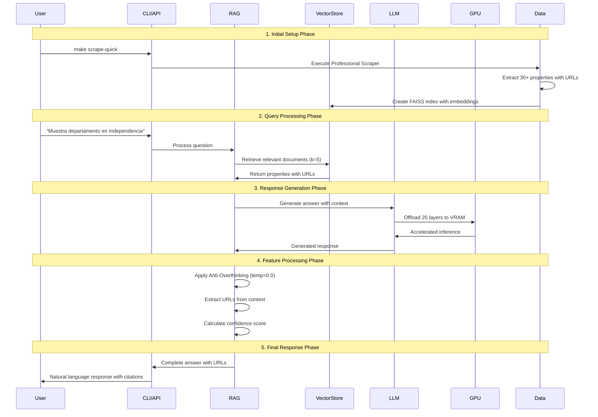
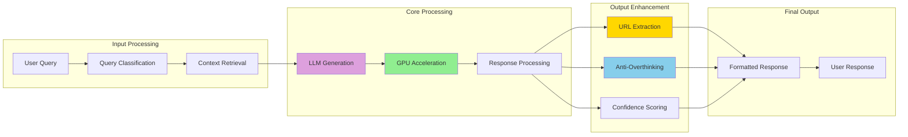
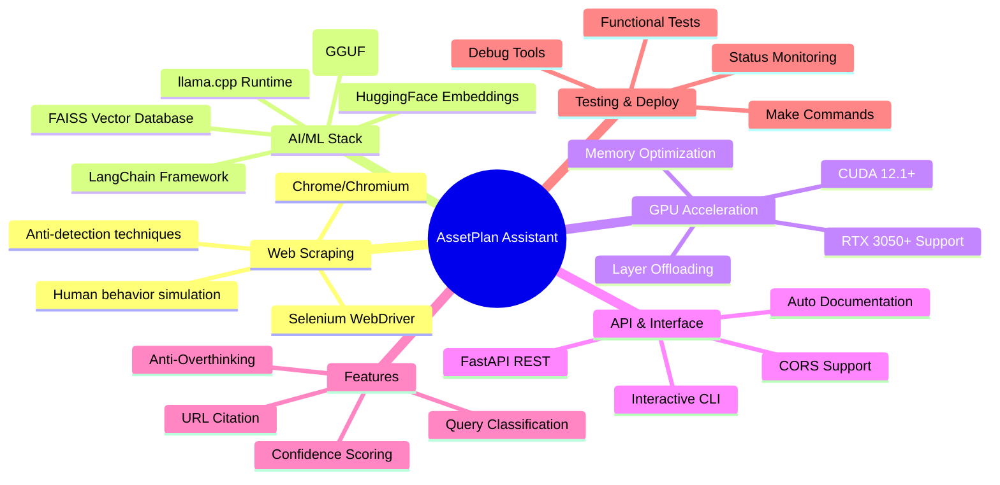
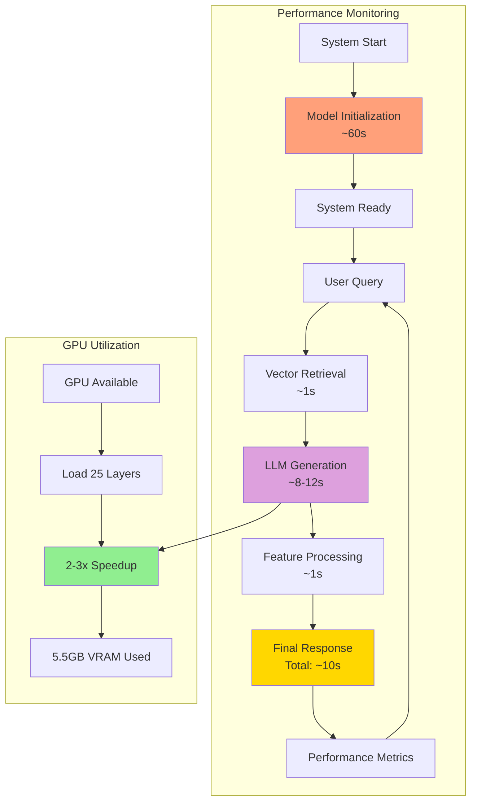

# 🏗️ Architecture Diagram - AssetPlan Property Assistant

## 📊 Sistema Completo: Scraper + RAG Agent

```mermaid
graph TB
    subgraph "🌐 Input Sources"
        ASSETPLAN[AssetPlan.cl Website]
        USER[User Queries]
        CLIENT[Client Applications]
    end
    
    subgraph "🕷️ Web Scraping Layer"
        SCRAPER[Professional Scraper]
        WDF[WebDriver Factory]
        HBS[Human Behavior Simulator]
        AE[AssetPlan Extractor v2]
        DV[Data Validator]
        RM[Retry Manager]
        PM[Performance Monitor]
        
        ASSETPLAN --> SCRAPER
        SCRAPER --> WDF
        SCRAPER --> HBS  
        SCRAPER --> AE
        SCRAPER --> DV
        SCRAPER --> RM
        SCRAPER --> PM
    end
    
    subgraph "💾 Data Storage Layer"
        JSON[properties.json<br/>30+ Properties]
        LOGS[Application Logs]
        
        SCRAPER --> JSON
        SCRAPER --> LOGS
    end
    
    subgraph "🧠 AI/ML Layer"
        VS[FAISS Vector Store]
        EMB[HuggingFace Embeddings<br/>Qwen3-8B-Q6_K]
        LLM[DeepSeek R1 GGUF<br/>8B-Q6_K Local Model]
        RAG[LangChain RAG Chain]
        
        JSON --> VS
        VS --> EMB
        VS --> RAG
        RAG --> LLM
    end
    
    subgraph "⚡ GPU Acceleration"
        CUDA[CUDA 12.1+]
        VRAM[GPU Memory<br/>25 Layers Offloaded]
        BATCH[Optimized Batching<br/>n_batch=256]
        
        LLM --> CUDA
        CUDA --> VRAM
        CUDA --> BATCH
    end
    
    subgraph "🔧 Core Features"
        URLS[URL Citation Engine]
        ANTI[Anti-Overthinking System]
        CONF[Confidence Scoring]
        CLASS[Query Classification]
        
        RAG --> URLS
        RAG --> ANTI
        RAG --> CONF
        RAG --> CLASS
    end
    
    subgraph "🌐 Interface Layer"
        API[FastAPI REST Server<br/>Port 8000]
        CLI[Interactive CLI Chat]
        DOCS[Auto Documentation<br/>/docs, /redoc]
        
        RAG --> API
        RAG --> CLI
        API --> DOCS
    end
    
    subgraph "🧪 Testing & Monitoring"
        TESTS[Test Suite]
        STATUS[System Status Monitor]
        DEBUG[Debug Tools]
        
        API --> TESTS
        CLI --> TESTS
        TESTS --> STATUS
        TESTS --> DEBUG
    end
    
    subgraph "👤 User Interaction"
        USER --> CLI
        CLIENT --> API
        
        API --> RESPONSE[JSON Responses with URLs]
        CLI --> CHAT[Natural Language Chat]
    end
    
    %% Styling
    style URLS fill:#FFD700,stroke:#FF8C00,stroke-width:3px
    style ANTI fill:#87CEEB,stroke:#4682B4,stroke-width:3px
    style CUDA fill:#90EE90,stroke:#32CD32,stroke-width:3px
    style JSON fill:#FFA07A,stroke:#FF6347,stroke-width:2px
    style RAG fill:#DDA0DD,stroke:#9370DB,stroke-width:3px
    style API fill:#F0E68C,stroke:#DAA520,stroke-width:2px
    style CLI fill:#F0E68C,stroke:#DAA520,stroke-width:2px
```

## 🔄 Data Flow: Scraping to Response

## 🎯 Component Interaction Matrix

## 🔧 Technology Stack

## 📊 Performance Metrics Flow

## 🛠️ System Architecture Benefits

### ✅ **Scalability Features**
- **Modular Design**: Independent scraping, RAG, and API layers
- **GPU Acceleration**: Horizontal scaling with multiple GPUs
- **Local Models**: No API rate limits or external dependencies
- **Caching**: Persistent FAISS index and embeddings

### ✅ **Reliability Features**  
- **Retry Mechanisms**: Circuit breaker patterns in scraping
- **Error Handling**: Comprehensive error management
- **Health Monitoring**: Real-time system status checks
- **Fallback Options**: CPU fallback when GPU unavailable

### ✅ **Performance Features**
- **Anti-Overthinking**: Optimized response generation
- **Memory Optimization**: Efficient GPU memory usage
- **Vector Caching**: Fast document retrieval
- **Batch Processing**: Optimized inference batching

### ✅ **User Experience Features**
- **URL Citation**: Direct links to original properties
- **Natural Language**: Conversational interface
- **Multiple Interfaces**: API and CLI options
- **Real-time Feedback**: Confidence scoring and metrics

---

**Architecture Status**: ✅ Fully Operational | All components integrated and tested