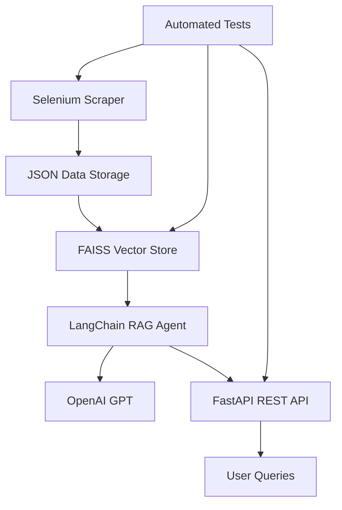

# 🗺️ ROADMAP - Agente Conversacional Scraper + LangChain

## 📋 Resumen del Proyecto
Desarrollar un agente conversacional que:
1. Scrapea propiedades de assetplan.cl
2. Crea base vectorial con FAISS  
3. Responde consultas usando LangChain + OpenAI
4. Expone API REST con FastAPI

**Tiempo límite**: 72 horas  
**Meta**: Primera respuesta en <60s en equipo t3.medium

---

## 🎯 Objetivos Obligatorios

### ✅ **1. Scraper Reproducible**
- [x] Extraer mínimo 50 propiedades de assetplan.cl
- [x] Usar Selenium para navegación
- [x] Guardar datos en JSON estructurado
- [x] Comando ejecutable: `make scrape` o script
- **Atributos**: precio, ubicación, m², habitaciones, URL, fotos
- **✅ COMPLETADO**: Implementado AssetPlanExtractorV2 siguiendo GUIA_UNICA_RESUMEN.md

### ✅ **2. Knowledge Base + LangChain**
- [ ] Implementar FAISS como vector store
- [ ] Cargar datos scrapeados al índice
- [ ] Crear RAG chain con LangChain
- [ ] Respuestas con citación de fuentes

### ✅ **3. API REST**
- [ ] FastAPI para exposición del agente
- [ ] Endpoint para consultas
- [ ] Respuesta JSON: `{answer, sources, confidence}`
- [ ] Documentación automática con Swagger

### ✅ **4. Tests Automatizados**
- [ ] Test scraping mínimo (>= 50 propiedades)
- [ ] Test inserción en vector store
- [ ] Test respuestas a 2-3 queries estándar
- [ ] Usar pytest

### ✅ **5. README + Diagrama**
- [ ] Instrucciones instalación desde cero
- [ ] Comandos para scraper, agente y tests
- [ ] Diagrama de arquitectura (Mermaid)
- [ ] Ejemplos de uso

### ✅ **6. Performance**
- [ ] Instalación + primera respuesta < 60s
- [ ] Optimización de carga vectorial
- [ ] Cache si es necesario

---

## 🏗️ Arquitectura Técnica



---

## 📦 Stack Tecnológico

- **Python**: 3.13 con uv
- **Web Scraping**: Selenium WebDriver
- **Vector DB**: FAISS
- **LLM Framework**: LangChain >= 0.3
- **LLM**: OpenAI GPT
- **API**: FastAPI
- **Testing**: pytest
- **Data**: Pydantic models
- **Dependency Management**: requirements.txt

---

## 🚀 Plan de Desarrollo

### **Fase 1: Setup & Professional Scraper** (8-12 horas)
- [x] Configurar estructura del proyecto
- [x] Instalar dependencias (Selenium, LangChain, FastAPI, FAISS)
- [x] Desarrollar scraper básico de assetplan.cl
- [x] Definir esquema de datos con Pydantic
- [x] **REFACTORING**: Implementar arquitectura profesional (ver SCRAPER_ARCHITECTURE.md)
  - [x] Infrastructure Layer: WebDriverFactory, HumanBehaviorSimulator
  - [x] Domain Layer: PropertyExtractor, DataValidator
  - [x] Service Layer: ScraperManager, RetryManager
  - [x] Testing Layer: Unit tests completos
- [x] Optimizar para extracción de 50+ propiedades
- [x] Implementar logging estructurado y monitoreo
- **✅ COMPLETADO**: AssetPlanExtractorV2 sigue flujo completo de GUIA_UNICA_RESUMEN.md

### **Fase 2: Vector Store & RAG** (12-16 horas)
- [ ] Implementar carga a FAISS
- [ ] Configurar embeddings (OpenAI)
- [ ] Crear cadena RAG con LangChain
- [ ] Pruebas de recuperación y respuesta

### **Fase 3: API & Integration** (8-12 horas)
- [ ] Desarrollar endpoints FastAPI
- [ ] Integrar agente con API
- [ ] Validación de entrada/salida
- [ ] Documentación Swagger

### **Fase 4: Testing & Docs** (4-8 horas)
- [ ] Tests automatizados completos
- [ ] README detallado
- [ ] Diagrama de arquitectura
- [ ] Optimización de performance

### **Fase 5: Bonus Features** (tiempo restante)
- [ ] Docker containerization
- [ ] Logging estructurado
- [ ] Manejo de errores robusto
- [ ] Actualización incremental

---

## 📝 Estructura del Proyecto

```
scrapper-llm-inmobiliario/
├── src/
│   ├── scraper/
│   │   ├── __init__.py
│   │   ├── assetplan_scraper.py
│   │   └── models.py
│   ├── vectorstore/
│   │   ├── __init__.py
│   │   ├── faiss_store.py
│   │   └── embeddings.py
│   ├── agent/
│   │   ├── __init__.py
│   │   ├── rag_chain.py
│   │   └── prompts.py
│   ├── api/
│   │   ├── __init__.py
│   │   ├── main.py
│   │   └── models.py
│   └── utils/
│       ├── __init__.py
│       └── config.py
├── tests/
│   ├── test_scraper.py
│   ├── test_vectorstore.py
│   └── test_api.py
├── data/
│   └── properties.json
├── requirements.txt
├── Makefile
├── README.md
├── ROADMAP.md
└── docker-compose.yml (bonus)
```

---

## ✅ Checklist de Entrega

### **Funcionalidad Core**
- [ ] Scraper funcional (>= 50 propiedades)
- [ ] Vector store operativo
- [ ] Agente responde consultas
- [ ] API REST funcional
- [ ] Tests passing

### **Documentación**
- [ ] README completo
- [ ] Diagrama de arquitectura
- [ ] Comentarios en código
- [ ] Documentación API

### **Performance**
- [ ] Setup < 60s
- [ ] Respuestas rápidas
- [ ] Manejo de errores

### **Código**
- [ ] Tipado con Pydantic
- [ ] Estructura modular
- [ ] Estilo consistente
- [ ] Tests automatizados

---

## 🎯 Queries de Ejemplo para Testing

1. "¿Qué departamentos de 2 dormitorios hay en Providencia bajo 3000 UF?"
2. "Muéstrame casas de más de 100 m² en Las Condes"
3. "¿Cuáles son las propiedades más baratas disponibles?"

---

## ⚡ Comandos Clave

```bash
# Scraping
make scrape

# Tests
make test

# API
make run

# Setup completo
make setup
```

---

**Estado**: 🏗️ EN DESARROLLO  
**Última actualización**: 2025-07-12  
**Progreso Scraper**: ✅ AssetPlanExtractorV2 implementado siguiendo guía completa  
**Siguiente fase**: Integración con LangChain RAG