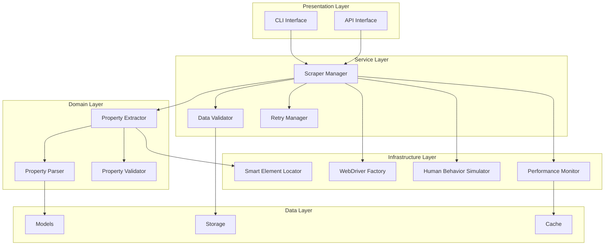

# 🕷️ Professional Web Scraping Architecture

## 📋 Arquitectura del Scraper Profesional

Este documento detalla la refactorización del scraper aplicando las mejores prácticas de la industria para web scraping con Selenium.

---

## 🎯 Principios de Diseño

### **1. Human-like Behavior (Comportamiento Humano)**
- **Random delays**: Pausas aleatorias entre acciones (0.5-3s)
- **Progressive scrolling**: Scroll suave y progresivo con velocidad variable
- **Mouse movements**: Movimientos naturales del mouse
- **Tab switching**: Gestión natural de pestañas y focus
- **Viewport simulation**: Simulación de diferentes tamaños de pantalla

### **2. Selenium Best Practices**
- **Explicit waits**: Esperas explícitas con condiciones específicas
- **Resource optimization**: Bloqueo de recursos innecesarios (imágenes, CSS, JS)
- **Memory management**: Gestión adecuada de memoria y cleanup
- **Error recovery**: Recuperación automática de errores comunes
- **Performance monitoring**: Monitoreo de rendimiento en tiempo real

### **3. Anti-Detection Measures**
- **User agent rotation**: Rotación de user agents realistas
- **Request headers**: Headers HTTP auténticos
- **Stealth mode**: Técnicas anti-detección
- **Session management**: Gestión inteligente de sesiones
- **Rate limiting**: Respeto a límites de velocidad

---

## 🏗️ Arquitectura por Capas



---

## 📦 Componentes Principales

### **1. WebDriver Factory**
```python
# Responsabilidad: Crear y configurar WebDrivers optimizados
class WebDriverFactory:
    - create_chrome_driver()
    - create_firefox_driver()
    - apply_stealth_config()
    - setup_performance_opts()
```

### **2. Human Behavior Simulator**
```python
# Responsabilidad: Simular comportamiento humano natural
class HumanBehaviorSimulator:
    - random_delay(min_sec, max_sec)
    - smooth_scroll(element, speed)
    - natural_mouse_movement()
    - simulate_reading_time()
```

### **3. Smart Element Locator**
```python
# Responsabilidad: Localizar elementos con fallbacks inteligentes
class SmartElementLocator:
    - find_element_with_retry()
    - find_elements_by_multiple_selectors()
    - wait_for_element_visibility()
    - handle_stale_elements()
```

### **4. Property Extractor**
```python
# Responsabilidad: Extraer datos específicos de propiedades
class PropertyExtractor:
    - extract_property_data()
    - parse_price_information()
    - extract_location_details()
    - get_property_images()
```

### **5. Data Validator & Cleaner**
```python
# Responsabilidad: Validar y limpiar datos extraídos
class DataValidator:
    - validate_property_data()
    - clean_price_format()
    - normalize_location()
    - validate_urls()
```

### **6. Retry & Recovery Manager**
```python
# Responsabilidad: Manejar errores y reintentos
class RetryManager:
    - exponential_backoff()
    - circuit_breaker()
    - handle_timeout_errors()
    - recover_from_stale_elements()
```

### **7. Performance Monitor**
```python
# Responsabilidad: Monitorear rendimiento y salud
class PerformanceMonitor:
    - track_scraping_speed()
    - monitor_memory_usage()
    - log_error_rates()
    - generate_health_reports()
```

---

## 🔧 Configuración Optimizada

### **Chrome Options (Optimizadas)**
```python
CHROME_OPTIONS = {
    'headless': True,
    'no_sandbox': True,
    'disable_dev_shm_usage': True,
    'disable_gpu': True,
    'disable_images': True,        # Optimización
    'disable_css': True,           # Optimización
    'disable_javascript': False,   # Algunas páginas lo necesitan
    'window_size': '1920,1080',
    'user_agent': 'Mozilla/5.0 (Windows NT 10.0; Win64; x64) AppleWebKit/537.36',
    'disable_blink_features': 'AutomationControlled',
    'exclude_switches': ['enable-automation'],
    'use_chromium': True
}
```

### **Wait Strategies**
```python
WAIT_STRATEGIES = {
    'element_present': 10,         # Elemento presente en DOM
    'element_visible': 15,         # Elemento visible
    'element_clickable': 10,       # Elemento clickeable
    'page_load': 30,              # Carga completa de página
    'ajax_complete': 20           # Completar llamadas AJAX
}
```

### **Human Behavior Patterns**
```python
HUMAN_PATTERNS = {
    'scroll_speed': (200, 800),    # pixels/segundo
    'read_time': (1, 3),          # segundos por elemento
    'action_delay': (0.5, 2.0),   # segundos entre acciones
    'typing_speed': (50, 150),     # ms por carácter
    'mouse_movement': 'bezier'     # Curvas Bézier naturales
}
```

---

## 📊 Estrategia de Testing

### **1. Unit Tests**
- Cada componente individualmente
- Mocks para WebDriver
- Validación de lógica de negocio
- Tests de modelos Pydantic

### **2. Integration Tests**
- Flujo completo de scraping
- Interacción entre componentes
- Tests con datos reales (limitados)
- Performance benchmarks

### **3. Property-based Tests**
- Generación automática de test cases
- Validación de invariantes
- Edge cases automáticos
- Fuzzing de inputs

### **4. Performance Tests**
- Tiempo de respuesta
- Uso de memoria
- Throughput de scraping
- Detección de memory leaks

---

## 🚨 Error Handling Strategy

### **1. Categorización de Errores**
```python
ERROR_CATEGORIES = {
    'network': ['TimeoutException', 'ConnectionError'],
    'element': ['NoSuchElementException', 'StaleElementReferenceException'],
    'navigation': ['WebDriverException', 'InvalidArgumentException'],
    'data': ['ValidationError', 'ParsingError'],
    'rate_limit': ['TooManyRequestsError', 'BlockedError']
}
```

### **2. Recovery Strategies**
```python
RECOVERY_STRATEGIES = {
    'network': 'exponential_backoff_retry',
    'element': 'refresh_and_relocate',
    'navigation': 'restart_driver',
    'data': 'skip_and_continue',
    'rate_limit': 'wait_and_retry'
}
```

### **3. Circuit Breaker Pattern**
- Falla rápida después de N errores consecutivos
- Tiempo de recuperación configurable
- Monitoreo de salud del sistema
- Alertas automáticas

---

## 📈 Monitoring & Observability

### **1. Métricas Clave**
- **Throughput**: Propiedades/minuto
- **Success Rate**: % de scraping exitoso
- **Error Rate**: % de errores por categoría
- **Response Time**: Tiempo promedio por propiedad
- **Memory Usage**: Consumo de memoria
- **CPU Usage**: Uso de CPU

### **2. Logging Estructurado**
```python
LOG_STRUCTURE = {
    'timestamp': 'ISO8601',
    'level': 'INFO|ERROR|DEBUG',
    'component': 'scraper|extractor|validator',
    'action': 'navigate|extract|validate',
    'property_url': 'url',
    'duration_ms': 'integer',
    'error_type': 'string',
    'retry_count': 'integer'
}
```

### **3. Health Checks**
- Estado del WebDriver
- Conectividad a sitio objetivo
- Calidad de datos extraídos
- Performance metrics
- Error rate thresholds

---

## 🎯 Implementation Plan

### **Fase 1: Infrastructure Layer (2-3 horas)**
1. **WebDriverFactory** con configuración optimizada
2. **HumanBehaviorSimulator** con patrones naturales
3. **SmartElementLocator** con fallbacks
4. **PerformanceMonitor** básico

### **Fase 2: Domain Layer (2-3 horas)**
1. **PropertyExtractor** refactorizado
2. **PropertyParser** con regex optimizados
3. **PropertyValidator** con reglas de negocio
4. **DataCleaner** para normalización

### **Fase 3: Service Layer (1-2 horas)**
1. **ScraperManager** orquestador principal
2. **RetryManager** con circuit breaker
3. **DataValidator** integrado
4. **Error handling** comprehensivo

### **Fase 4: Testing & Optimization (1-2 horas)**
1. **Unit tests** para todos los componentes
2. **Integration tests** end-to-end
3. **Performance benchmarks**
4. **Monitoring dashboard**

---

## ✅ Success Criteria

### **Funcionalidad**
- ✅ Extrae 50+ propiedades consistentemente
- ✅ Datos estructurados y validados
- ✅ Error rate < 5%
- ✅ Performance > 10 propiedades/minuto

### **Calidad**
- ✅ Cobertura de tests > 90%
- ✅ Documentación completa
- ✅ Logging estructurado
- ✅ Monitoreo en tiempo real

### **Robustez**
- ✅ Recuperación automática de errores
- ✅ Comportamiento humano simulado
- ✅ Anti-detección efectivo
- ✅ Resource optimization

---

**Estado**: 🚧 EN DESARROLLO  
**Próximo milestone**: Infrastructure Layer Implementation  
**Tiempo estimado**: 6-8 horas total